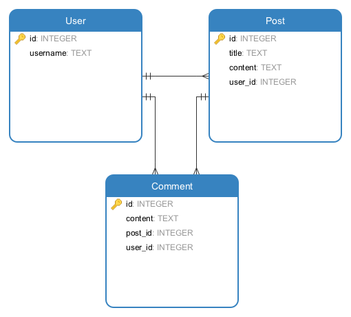
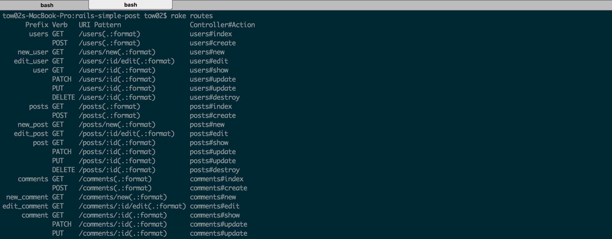

# rails-simple-post

## Models

We are going to write a simple web application that allows user to create post and comment. Here is the model relationship.



## Starting project

```bash
$ rails new rails-simple-post --skip-spring
```

## Gemfile

Update Gemfile into this

```ruby
source 'https://rubygems.org'

gem 'rails', '4.2.5'
gem 'sqlite3'
gem 'sass-rails', '~> 5.0'
gem 'uglifier', '>= 1.3.0'
gem 'coffee-rails', '~> 4.1.0'
gem 'jquery-rails'
gem 'turbolinks'
gem 'jbuilder', '~> 2.0'
gem 'sdoc', '~> 0.4.0', group: :doc

group :development, :test do
  # Call 'byebug' anywhere in the code to stop execution and get a debugger console
  gem 'byebug'
  gem 'annotate'
  gem 'better_errors'
  gem 'rspec-rails', '~> 3.0'
end

group :development do
  # Access an IRB console on exception pages or by using <%= console %> in views
  gem 'web-console', '~> 2.0'
end

```

Then run

```bash
$ bundle install
$ rails generate rspec:install
```

## Generate Model

```bash
$ rails g model User username:text
$ rails g model Post title:text content:text user:references
$ rails g model Comment content:text user:references post:references
```

After this, we need to add relationship

```ruby
# app/models/user.rb
class User < ActiveRecord::Base
  has_many :posts
  has_many :comments
end
```

```ruby
# app/models/post.rb
class Post < ActiveRecord::Base
  belongs_to :user
  has_many :comments
end
```

```ruby
# app/models/comment.rb
class Comment < ActiveRecord::Base
  belongs_to :user
  belongs_to :post
end
```

After this, run `rake db:migrate` in terminal

## Controllers

```bash
$ rails g controller Users
$ rails g controller Posts
$ rails g controller Comments
```

```ruby
# config/routes.rb
Rails.application.routes.draw do
  resources :users
  resources :posts
  resources :comments
end
```

To get url path for users, posts, and comments,
type the following command.

```bash
$ rake routes
```

You will see something like this in the terminal.



## Import Bootstrap

[Download bootstrap from here](http://getbootstrap.com/getting-started/#download)
